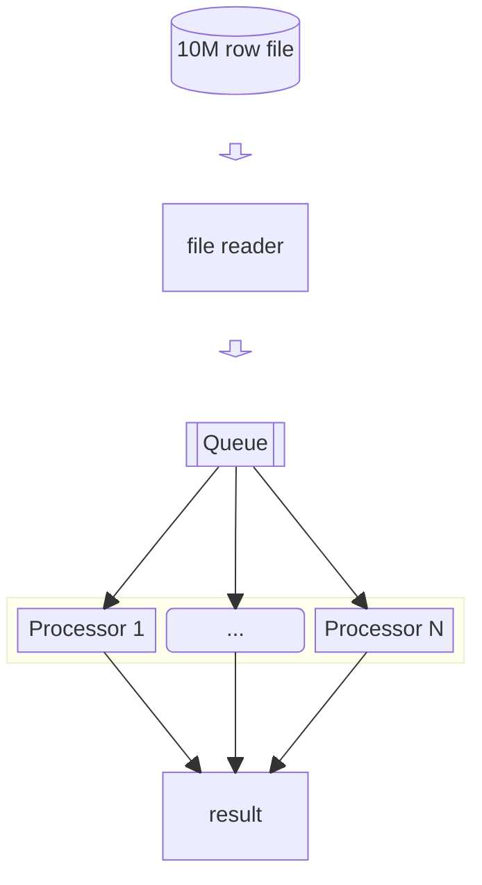

# Basic Approach

## Approach

1. Basically, it is trying to mimic real-world architecture where some system can contain many (micro-) services.
   - One process will read the file and then put the data into a queue.
   - Other processes will read the data from the queue and then process it.
2. This will use basic/standard Java library to read the file, ie `BufferedReader`.
3. The queue will be implemented using `BlockingQueue`.
4. The processing will be done in parallel using `VirtualThread`.
5. The data is aggregated using `AtomicInteger`.

## Result
On M1 Macbook Air with 8-core CPU & 8GB RAM, it processes 10M of row in ~4 seconds.

Adjusting the number of workers/threads doesn't improve the performance. It seems that the bottleneck is on the file reading.
