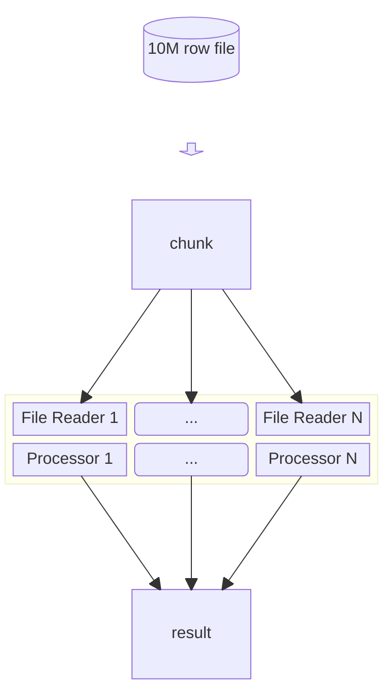

# Experimental Approach
This approach uses some experimental Java library: [Memory Segment & Arena](https://docs.oracle.com/en/java/javase/22/core/memory-segments-and-arenas.html). This feature basically has ability to read the file faster from the memory.

## Approach

Basically, it similar to the basic approach. It will try to distribute the workloads into several workers/threads. However, the main difference here is the file reading are done in parallel. The file reading is done using Memory Segment & Arena, which is expected to be faster than the standard file reading.

1. First, it will calculate the chunk size based on the assigned number of workers.
2. Based on that chunk size, it will be distributed into several workers/threads.
3. Each worker/thread will read the chunk and then calculate the result at the same process.
4. The data is aggregated in the end.

## Result
On M1 Macbook Air with 8-core CPU & 8GB RAM, it processes 10M of row in ~300 ms.

Number of workers: 2

| No. | Time (ms) |
|-----|-----------|
| 1   | 799       |
| 2   | 562       |
| 3   | 732       |
| 4   | 550       |
| 5   | 583       |

Number of workers: 4

| No. | Time (ms) |
|-----|-----------|
| 1   | 548       |
| 2   | 360       |
| 3   | 395       |
| 4   | 381       |
| 5   | 380       |

Number of workers: 6

| No. | Time (ms) |
|-----|-----------|
| 1   | 446       |
| 2   | 334       |
| 3   | 349       |
| 4   | 393       |
| 5   | 346       |

Number of workers: 8

| No. | Time (ms) |
|-----|-----------|
| 1   | 338       |
| 2   | 390       |
| 3   | 309       |
| 4   | 321       |
| 5   | 336       |

Number of workers: 12

| No. | Time (ms) |
|-----|-----------|
| 1   | 471       |
| 2   | 376       |
| 3   | 386       |
| 4   | 401       |
| 5   | 421       |

### Analysis
1. The maximum optimal number of workers/threads is 8, which is the same as the number of CPU cores.
2. Increasing from 2 until 8 workers/threads improves the performance.
3. Increasing the number of workers/threads doesn't improve the performance. It's expected as the number of physical CPU can play huge factor here.

### Notes
1. Surprisingly, using GraalVM's Native Image doesn't improve the performance. It's even much slower than using JVM: ~6 seconds.
2. Using VirtualThreads doesn't improve the performance.
